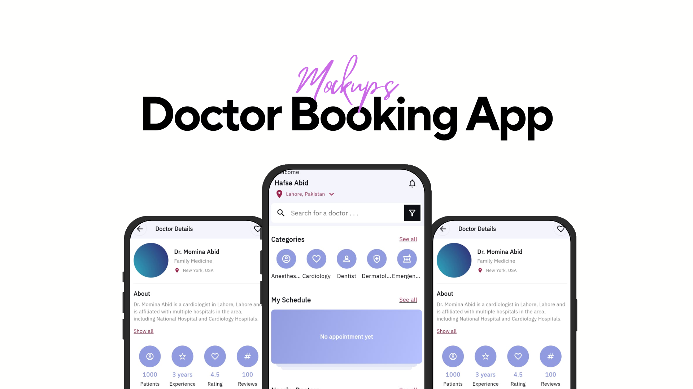

## Flutter Doctor Booking App

The Flutter Doctor Booking App template offers a contemporary UI designed for managing the appointment scheduling process for both patients and healthcare providers. Built with Flutter, this template serves as a foundational framework for developers aiming to create a doctor booking app efficiently.

### Screens & UI Elements
The template comprises seven primary screens:
- **Home**
- **Doctor List**
- **Doctor Details**
- **Doctor Categories**
- **Book Appointment: Select Date & Time**
- **Book Appointment: Select Package**
- **Book Appointment: Patient Details**

### Features & Functionalities:
The template provides several key functionalities:
- Browse doctor categories and navigate to specific listings.
- Filter doctors by category and view detailed profiles.
- Access comprehensive doctor profiles, including working hours.
- Book appointments by selecting doctors, packages, and specifying personal details.
- Receive reminders for upcoming appointments.

If you're curious about how these features are implemented, here are more details about the app's functionalities:

### Screenshot


### State Management
The app employs the BLoC Pattern to separate UI from business logic. It utilizes the flutter_bloc library to manage user inputs, application lifecycle events, and data presentation across screens. Key BLoCs include:

- **Home BLoC**: Manages retrieval and display of appointment, doctor, and clinic information on the Home Screen.
- **Doctor List BLoC**: Fetches and stores lists of doctors based on user selections.
- **Doctor Details BLoC**: Handles data retrieval and state management for individual doctor profiles.
- **Book Appointment BLoC**: Manages user inputs throughout the appointment booking process and initiates new booking procedures.

### Database Client (packages/db_client)
The template includes a dedicated local package to facilitate database interactions. It utilizes an in-memory implementation with mock data to support app functionality.

### Navigation
Screen navigation is facilitated through GoRouter for seamless transitions between app screens.

### Localization (l10n)
The template supports global accessibility through the flutter_localizations package. It enables easy localization of app strings and values for multiple languages and locales.

## Getting Started
To run the template, follow these steps:

### Step 1: Add Dependencies
Navigate to the project root and add dependencies using the following command:
```dart
flutter pub get
```

### Step 2: Run the Application
Start the iOS simulator or Android emulator, then execute the application:
```dart
flutter run
```

This setup will launch the Doctor Booking App template, allowing you to explore its functionalities and customize it according to your needs.
